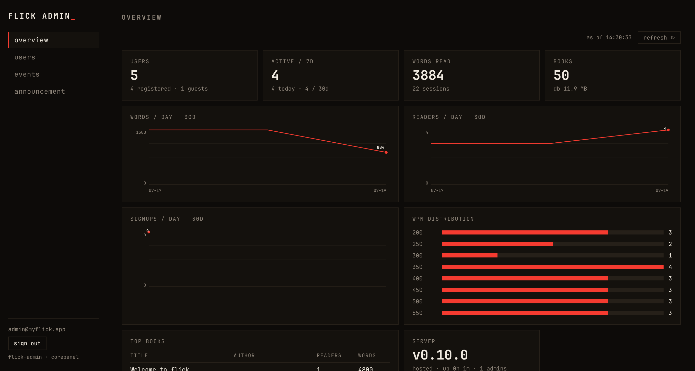
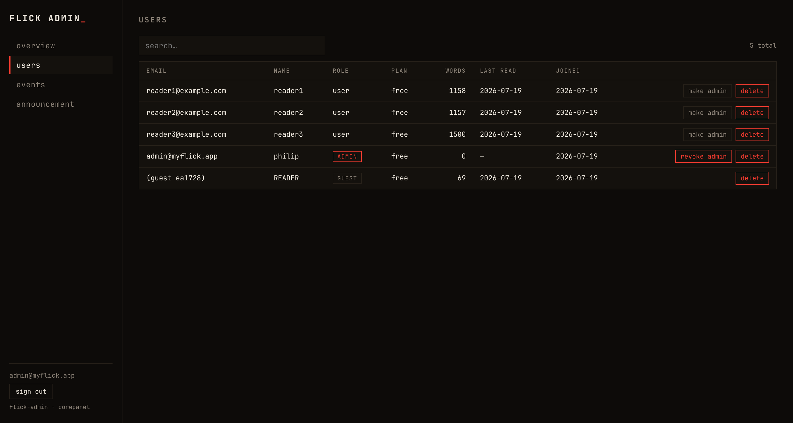
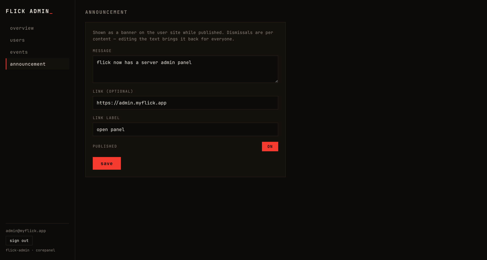

# flick-admin

[](https://github.com/one-more-refactor/flick-admin/actions/workflows/ci.yml)
[](https://github.com/one-more-refactor/flick-admin/releases/latest)
[](LICENSE)

The server admin panel for [**flick**](https://github.com/one-more-refactor/flick) — analytics, user management, events, and the user-site announcement banner. Fully isolated from the user app: its own repo, its own port, bearer-only auth against `/api/admin/*` ([CONTRACTS.md › Admin API](https://github.com/one-more-refactor/flick/blob/master/docs/CONTRACTS.md)).

Built on [**corepanel**](https://github.com/one-more-refactor/corepanel) as a dependency, not a fork — this repo is just providers + page config (~200 lines).



- **Overview** — users/guests, actives (1d/7d/30d), words + readers + signups per day, WPM distribution, top books, DB size, server version/uptime. Auto-refreshes.
- **Users** — search, paging, promote/demote admins, plan, delete (cascade).
- **Events** — the referral/free-pro/promo events, end them early.
- **Announcement** — the banner shown on the user site; publish/unpublish with a toggle.

<table><tr>
<td width="50%"></td>
<td width="50%"></td>
</tr></table>

## Who can sign in

1. **Admin users** — accounts with `is_admin` (flip it in the users table, or bootstrap below). Email + password; sessions expire after 12 h.
2. **The env token** — `FLICK_ADMIN_TOKEN` as break-glass "use an admin token instead".

Bootstrap the first admin with the token: sign in with it, open **users**, hit *make admin* on your account.

## Develop

Needs [flick-backend](https://github.com/one-more-refactor/flick-backend) on `:8484` (Vite proxies `/api`).

```sh
bun install && bun run dev    # http://localhost:5175
bun run check && bun run build
```

## Deploy

Static build + nginx that proxies `/api` to the backend container (`deploy/`):

```sh
podman build -t flick-admin https://github.com/one-more-refactor/flick-admin.git -f deploy/Containerfile
```

Quadlet units in [`deploy/`](deploy) put it on `127.0.0.1:3013` behind your tunnel/proxy, joined to the backend via a shared `flick` network. Set on the backend: `FLICK_ADMIN_ORIGIN=https://admin.your.domain` (CORS, only needed if the panel is NOT proxied same-origin) and `FLICK_ADMIN_URL=https://admin.your.domain` (adds the ADMIN link to the user app's account menu).

## License

[AGPL-3.0-only](LICENSE).
